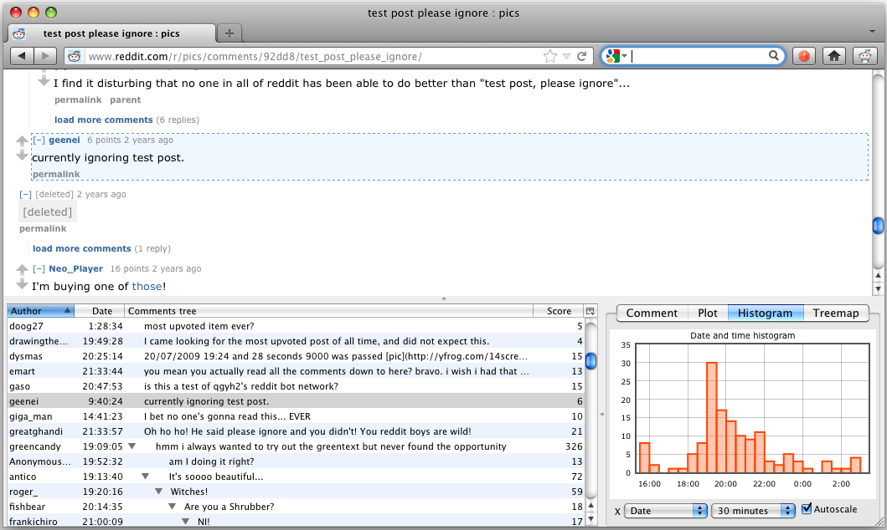

plottit
=======

The Plottit Firefox extension makes graphs and treemaps of [reddit](http://www.reddit.com) discussions. 

Read more about plottit's capabilities in the [user manual](http://www.titusjan.nl/plottit/manual/).

To download the installer go to http://www.titusjan.nl/plottit/

Screen shots
------------

